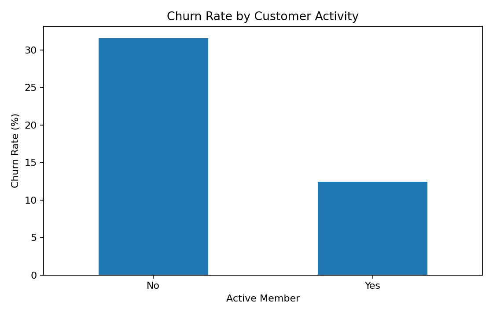
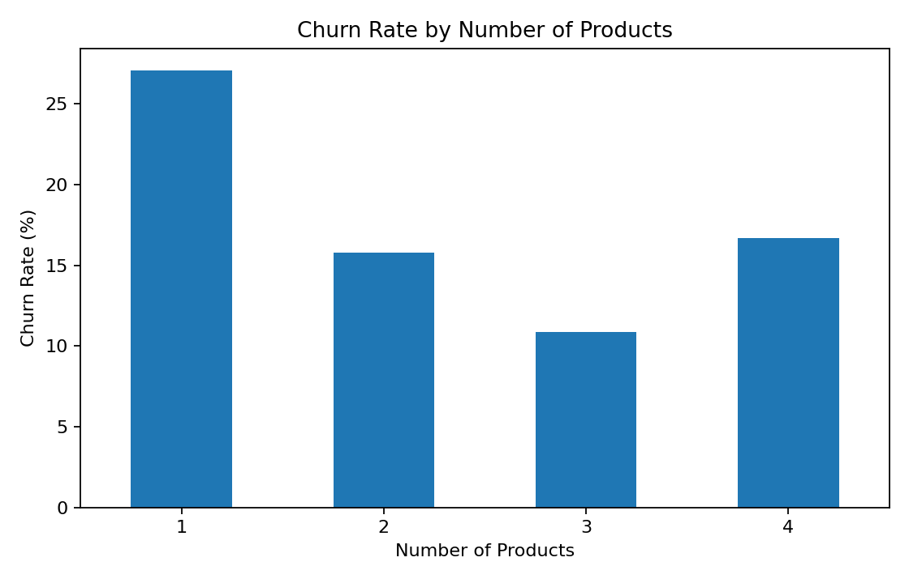
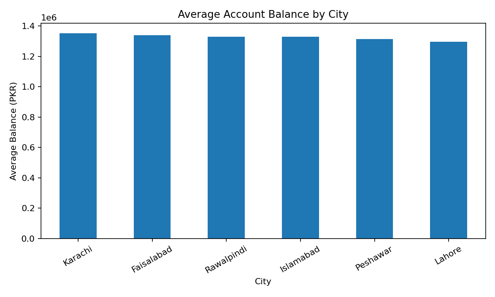

# Banking Customer Analysis

This project explores a synthetic banking customer dataset to understand customer behaviour, account balances, digital banking usage, product usage and churn.

The goal is to use Python and basic data analysis to turn customer-level data into useful business insights.

## Dataset

The dataset contains 500 fictional banking customers created for learning and portfolio purposes.

It includes:

- Age
- City
- Annual income
- Account balance
- Credit score
- Number of banking products
- Monthly transactions
- Digital banking usage
- Active member status
- Customer churn

## Tools Used

- Python
- Pandas
- Matplotlib
- Jupyter Notebook

## Questions Explored

- What does the average customer look like?
- Are inactive customers more likely to leave?
- Does digital banking usage relate to churn?
- How does churn vary by number of products?
- Which cities have higher average account balances?

## Key Findings

- Overall churn rate: 19.0%
- Inactive customers had a churn rate of 31.6%
- Active customers had a churn rate of 12.5%
- Customers not using digital banking had a churn rate of 23.6%
- Digital banking users had a churn rate of 16.2%

  ## Visualisations

### Customer Activity & Churn

### Product Usage & Churn

### Average Account Balance by City

## Business Interpretation

The analysis suggests that customer engagement may be linked with retention.

Inactive customers and customers who are not using digital banking showed higher churn in this synthetic dataset.

A bank could use similar analysis to identify customers who may need better engagement, targeted offers or retention campaigns.

## Project Files

- `banking_customers.csv` — customer dataset
- `banking_customer_analysis.ipynb` — Python analysis
- `charts/` — visualisations created from the analysis

## Note

This dataset is synthetic and does not contain real customer information. The project is for learning and portfolio purposes only.
